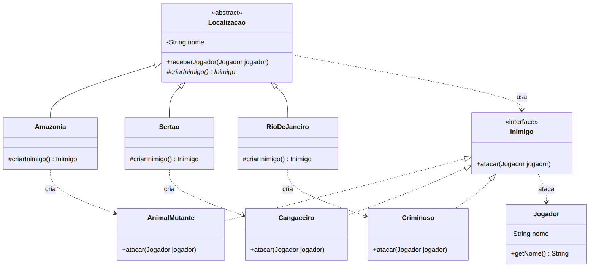

# Padrão Factory Method — Jogo de ação no Brasil

Lista Avaliativa I — Padrões de Projetos Orientados a Objetos.

## Enunciado (resumo)
Um jogo de ação se passa em localizações brasileiras e cada localização tem os seus próprios inimigos:
- **Amazônia** → animais mutantes (versão demo);
- **Sertão** → cangaceiros (pedido dos jogadores);
- **Rio de Janeiro** (futuro) → criminosos.

Qualquer que seja a localização, os inimigos sempre atacam o jogador que passa por ela, e para o jogador
pouco importa onde ele está: há garantia de que haverá inimigos.

Tarefa: usando **Factory Method**, desenhar um diagrama de classes, codificar e simular a situação,
da forma mais simples possível.

## Diagrama de classes
Fonte em [`docs/diagrama.mmd`](docs/diagrama.mmd) (Mermaid) e imagem em [`docs/diagrama.png`](docs/diagrama.png).



| Papel no Factory Method | Classe |
|---|---|
| Produto | `Inimigo` |
| Produtos concretos | `AnimalMutante`, `Cangaceiro`, `Criminoso` |
| Criador (declara o *factory method*) | `Localizacao` → `criarInimigo()` |
| Criadores concretos | `Amazonia`, `Sertao`, `RioDeJaneiro` |

## Como executar (a partir da raiz do repositório)

```bash
javac -encoding UTF-8 -d out jogo/*.java
java -cp out Main
```

Saída da simulação:

```
Jogador 1 entrou na fase: Amazônia
  Um animal mutante salta da mata e ataca Jogador 1!
Jogador 1 entrou na fase: Sertão
  Um cangaceiro surge na caatinga e ataca Jogador 1!
Jogador 1 entrou na fase: Rio de Janeiro
  Um criminoso aparece no beco e ataca Jogador 1!
```

> No Windows, se os acentos aparecerem trocados no terminal, rode `chcp 65001` antes ou use
> `java -Dstdout.encoding=UTF-8 -cp out Main`.

## Por que Factory Method aqui?
- `Localizacao.receberJogador()` contém a regra comum (“sempre há um inimigo e ele ataca”) e **não conhece
  nenhuma classe concreta de inimigo**: ela chama o *factory method* `criarInimigo()`.
- Cada subclasse decide qual inimigo criar. Adicionar o Rio de Janeiro (Passo 7) foi só criar
  `Criminoso` + `RioDeJaneiro`, sem alterar as classes existentes (princípio aberto/fechado).

## Uso de IA
Prompts, tutorial e ajustes estão em [PROMPTS.md](PROMPTS.md). A evolução da solução pode ser lida no
histórico de commits: um commit por passo do tutorial + um commit por ajuste.
